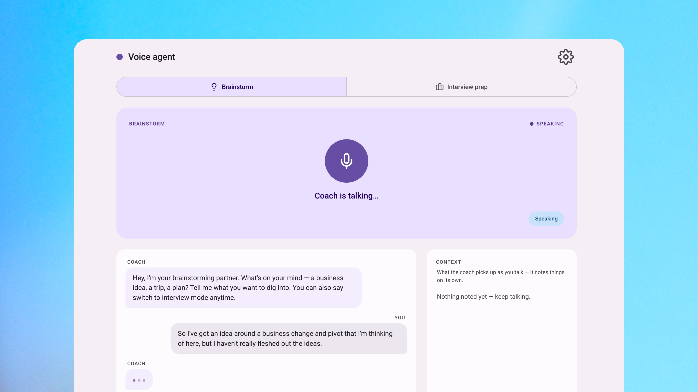

# Build an advanced voice agent

A voice agent that you can talk to and explore different idea, which was built using
[AssemblyAI's Voice Agent API](https://www.assemblyai.com/docs/voice-agents/voice-agent-api?utm_source=newsletter&utm_medium=influencer&utm_campaign=loop&utm_content=u35_realtime)
with the Universal-3.5 Pro Realtime speech model.



One WebSocket handles the speech-to-text, LLM, and voice agent's reply. You can either run it
as a brainstorming partner that explores ideas, or as an interview coach that helps you
prepare for an upcoming event.

## `coach.py` — terminal voice agent

A single Python file. Streams your microphone to the Voice Agent API, replies in voice as
either an **interview coach** (drills you on STAR answers) or a **brainstorming partner**
(pushes back on your ideas), and plays the reply through your speakers. Pick a mode at
launch, or switch by voice mid-conversation ("switch to brainstorming").

```bash
python3 -m venv .venv && source .venv/bin/activate
pip install websockets sounddevice numpy python-dotenv
cp .env.example .env          # then paste your key into .env
python coach.py               # or: python coach.py brainstorm
```

Run it with headphones — a terminal has no echo cancellation.

## `web/index.html` — browser voice agent

A single, self-contained HTML page with a Material 3 interface. The same two modes, each
with its own colour palette, plus a live transcript, voice mode-switching, and a **context
panel** showing what the agent has picked up as you talk. Browsers do echo cancellation for
you, so no headphones needed.

```bash
python3 -m http.server 8000 --directory web
# open http://localhost:8000 in Chrome or Edge, then paste your key in Settings (⚙)
```

## Full setup guide

To get the step-by-step instructions, including how to get your AssemblyAI API key, you can read the full guide at:

**https://loopnews.io/academy/build-advanced-voice-agent**
